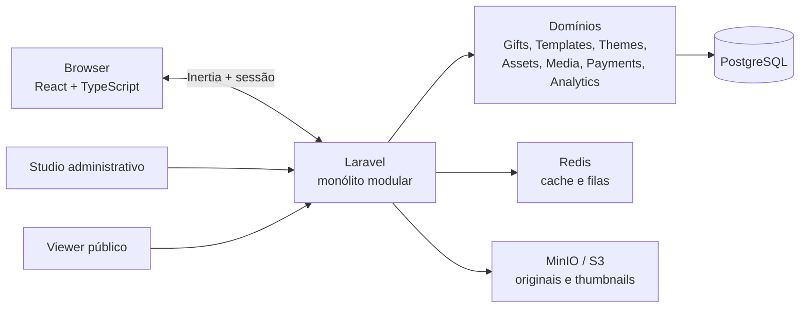

<div align="center">

# Scrapbook

### Memórias digitais com a experiência de um presente feito à mão

Plataforma web para criar, personalizar, publicar e compartilhar scrapbooks digitais
interativos a partir de temas e modelos versionados.

<p>
  
  
  
  
  
  
</p>

</div>

> **Status:** produto em desenvolvimento. O fluxo de criação, edição, checkout,
> publicação e compartilhamento está implementado; pagamentos reais ainda não estão
> integrados e o ambiente local utiliza um provedor manual de desenvolvimento.

## Visão geral

O **Scrapbook** transforma fotos, mensagens, músicas e elementos decorativos em um
presente digital que pode ser aberto página por página. O criador parte de uma ocasião
e de um modelo, personaliza o conteúdo em um editor visual, revisa o resultado e gera
um link público ou QR Code para a pessoa presenteada.

O principal desafio técnico do projeto é manter editor e visualizador público fiéis ao
mesmo documento de canvas, sem abrir mão de autorização, processamento de mídia,
versionamento de modelos e segurança do conteúdo publicado.

<table>
  <tr>
    <td align="center"><strong>🎨 Editor visual</strong><br />Canvas, camadas e autosave</td>
    <td align="center"><strong>📖 Experiência</strong><br />Álbum digital responsivo</td>
    <td align="center"><strong>🔗 Compartilhamento</strong><br />Link, QR Code e cartão</td>
    <td align="center"><strong>🛠️ Operação</strong><br />Studio, analytics e auditoria</td>
  </tr>
</table>

## Jornada do produto

| Etapa | Experiência |
| --- | --- |
| **Descoberta** | Landing page, demonstração e seleção da ocasião do presente. |
| **Ponto de partida** | Escolha de um modelo publicado e criação de uma cópia versionada para o usuário. |
| **Personalização** | Edição de textos, fotos, stickers, fundos, posições, dimensões, rotação e camadas. |
| **Revisão** | Preview privado e checklist de publicação antes do checkout. |
| **Checkout** | Criação de pedido pendente e aprovação manual apenas em ambiente de desenvolvimento. |
| **Publicação** | Liberação do presente após pagamento aprovado, com endereço público protegido. |
| **Entrega** | Compartilhamento por link, QR Code ou cartão para impressão. |
| **Acompanhamento** | Métricas do presente para o proprietário e visão agregada para administradores. |

## Diferenciais técnicos

### Editor e renderer compartilhado

- Canvas tipado com artboard e elementos de texto, imagem, música, sticker e interações.
- Transformações visuais de posição, tamanho e rotação.
- Organização por camadas, bloqueio e ocultação de elementos.
- Fundos de página e biblioteca de assets vinculados ao tema.
- Histórico local de edição, autosave e aviso de alterações não salvas.
- Mesmo contrato visual utilizado no preview e no presente publicado.
- Viewer responsivo com comportamento de livro aberto em telas amplas e uma página por
  vez em telas compactas.

### Mídia e publicação

- Upload de imagens associado ao usuário e ao presente correto.
- Processamento de mídia, geração de thumbnails e armazenamento S3-compatible.
- Checklist que impede a publicação de canvas ou referências de mídia inválidas.
- Estados de rascunho, pagamento pendente, publicado, desativado e expirado.
- QR Code e cartão de compartilhamento gerados para presentes publicados.

### Studio administrativo

- Criação e manutenção de temas, modelos e assets visuais.
- Versionamento para preservar a aparência de presentes já criados.
- Bloqueio temporário de edição e detecção de revisões concorrentes.
- Catálogo de ocasiões, planos e categorias de assets.
- Inspeção operacional de presentes sem alterar o conteúdo do cliente.
- Dashboard de analytics e auditoria automatizada de qualidade visual.

## Arquitetura



O backend segue um **monólito modular**. Controllers mantêm a camada HTTP enxuta,
enquanto actions e services concentram os fluxos de negócio. Models, enums e objetos
de dados ficam próximos ao domínio que os utiliza.

```text
HTTP → controller → action/service → model/policy → PostgreSQL
                                 └→ queue / storage
```

## Domínios principais

| Domínio | Responsabilidade |
| --- | --- |
| **Gifts** | Presente, páginas, edição, preview, publicação e acesso público. |
| **Templates** | Ocasiões, modelos, versões e páginas-base. |
| **Themes** | Tokens visuais, materiais do livro e versões de tema. |
| **Assets** | Stickers, papéis, texturas e elementos reutilizáveis. |
| **Media** | Upload, processamento e entrega autorizada das imagens do usuário. |
| **Payments** | Planos, pedidos, pagamentos e publicação após aprovação. |
| **Analytics** | Sessões, eventos, visitas, agregações e retenção de dados. |
| **Admin** | Studio visual, catálogo, operação, analytics e controle de acesso. |

## Stack

| Camada | Tecnologias |
| --- | --- |
| **Frontend** | React 19, TypeScript, Inertia.js 3, Vite 8, Tailwind CSS 4, Zustand, Zod, Lucide |
| **Backend** | PHP 8.3+, Laravel 13, Eloquent, Laravel Horizon, Intervention Image |
| **Autorização e auditoria** | Policies, Spatie Permission e Spatie Activitylog |
| **Dados e infraestrutura** | PostgreSQL 16, Redis 7, MinIO/S3 e Docker Compose |
| **Qualidade** | PHPUnit 12, Larastan/PHPStan, Laravel Pint, ESLint e Prettier |

## Segurança e confiabilidade

- Autenticação por sessão e papéis separados para cliente, suporte e administrador.
- Policies verificam a propriedade do presente, das páginas e das mídias.
- Rotas de login, cadastro, analytics e upload possuem limitação de requisições.
- O canvas rejeita HTML, protocolos inseguros, URLs externas e referências a mídias ou
  assets que não pertencem ao contexto autorizado.
- Uploads rejeitam SVG e arquivos que não sejam imagens, além de aplicar limites de
  tamanho e dimensões.
- O viewer público entrega somente dados sanitizados e não expõe caminhos internos de
  armazenamento ou informações do proprietário.
- Eventos de acesso não armazenam o endereço IP bruto.
- O processamento de aprovação de pagamento é idempotente.

## Rotas principais

| Área | Rotas |
| --- | --- |
| Marketing e acesso | `/`, `/demo`, `/login`, `/cadastro` |
| Criação | `/criar`, `/criar/{occasion}`, `/criar/{occasion}/{template}` |
| Área do usuário | `/app/gifts`, `/app/gifts/{gift}/edit`, `/preview`, `/review` |
| Pagamento e entrega | `/app/gifts/{gift}/checkout`, `/share`, `/qr-code`, `/share-card` |
| Presente público | `/p/{slugToken}` |
| Administração | `/admin`, `/admin/studio/*`, `/admin/catalog`, `/admin/operations`, `/admin/analytics`, `/admin/visual-qa` |

## Estrutura do projeto

```text
.
├── app/
│   ├── Domain/              # Regras organizadas por domínio
│   ├── Http/                # Controllers, requests, middleware e resources
│   └── Policies/            # Autorização por recurso
├── resources/js/
│   ├── components/renderer/ # Renderer compartilhado
│   ├── features/gifts/      # Criação, editor, preview e compartilhamento
│   ├── features/admin/      # Studio e operação administrativa
│   └── features/marketing/  # Landing page
├── database/                # Migrations, factories e seeders
├── tests/                   # Testes unitários e de integração
└── compose.yaml             # App, Vite, fila, PostgreSQL, Redis e MinIO
```

## Como executar localmente

### Pré-requisitos

- Docker e Docker Compose.

### Subir a aplicação

```bash
# Na raiz do projeto
cp .env.example .env
docker compose up --build

# Em outro terminal, carregar catálogo, temas, modelos, plano e acesso local
docker compose exec app php artisan db:seed
```

| Serviço | Endereço padrão |
| --- | --- |
| Aplicação | `http://localhost:8000` |
| PostgreSQL | `localhost:5432` |
| Redis | `localhost:6379` |
| MinIO API | `http://localhost:9000` |
| MinIO Console | `http://localhost:9001` |

O seeder cria um administrador exclusivamente para desenvolvimento. Defina
`ADMIN_EMAIL` e `ADMIN_PASSWORD` no `.env` antes de executá-lo; se ambos permanecerem
vazios, o fallback local é `admin@scrapbook.local` / `password`.

> O checkout local utiliza `manual_dev`: não existe cobrança, Pix ou transação real.
> A publicação continua condicionada à aprovação do pagamento simulado.

## Qualidade

```bash
# Testes de domínio e integração
docker compose exec app php artisan test

# Análise estática e formatação PHP
docker compose exec app composer analyse
docker compose exec app composer format:test

# Frontend
docker compose exec vite npm run lint
docker compose exec vite npm run typecheck
docker compose exec vite npm run build
```

A suíte cobre autenticação, autorização, canvas, mídia, checkout, publicação, viewer
público, QR Code, analytics, retenção, versionamento administrativo e auditoria visual.

<details>
<summary><strong>Solução para erro de permissão no build</strong></summary>

Se `npm run build` falhar com `EACCES` em `public/build`, normalmente existem artefatos
antigos criados como `root`. Limpe ou ajuste a propriedade somente de `public/build`,
que é ignorado pelo Git; evite aplicar `chmod` ou `chown` de forma ampla no projeto.

</details>

## Competências demonstradas

- Modelagem de um produto digital com criação, compra, publicação e entrega.
- Desenvolvimento de editor visual tipado com estado, histórico e autosave.
- Arquitetura de monólito modular com regras separadas por domínio.
- Processamento seguro de uploads e integração com storage S3-compatible.
- Autenticação, autorização por recurso e proteção de conteúdo público.
- Versionamento de temas, modelos e assets sem quebrar presentes existentes.
- Analytics com agregação, retenção e cuidado com dados sensíveis.
- Testes automatizados de fluxos críticos e regras de segurança.
- Orquestração de aplicação, filas, banco, cache e storage com Docker Compose.

## Autor

Desenvolvido por **Murilo Pereira Macedo**, estudante de Análise e Desenvolvimento de
Sistemas.
